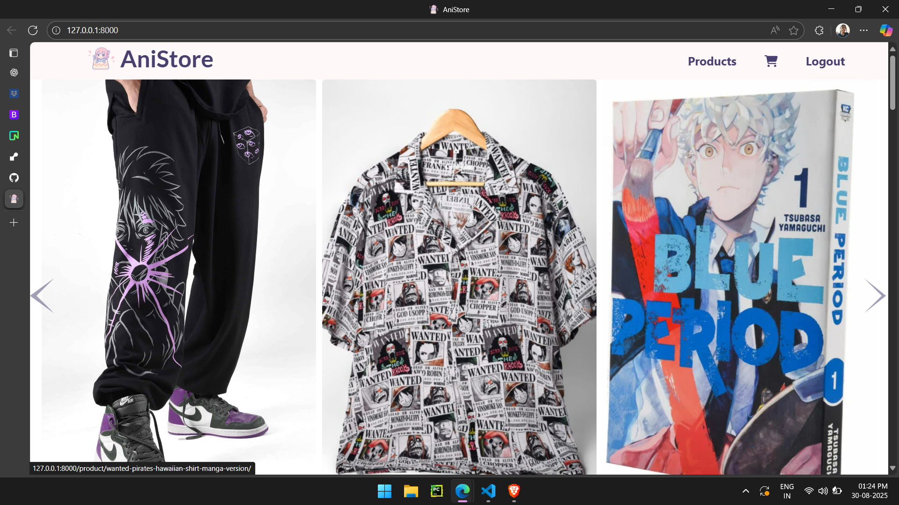
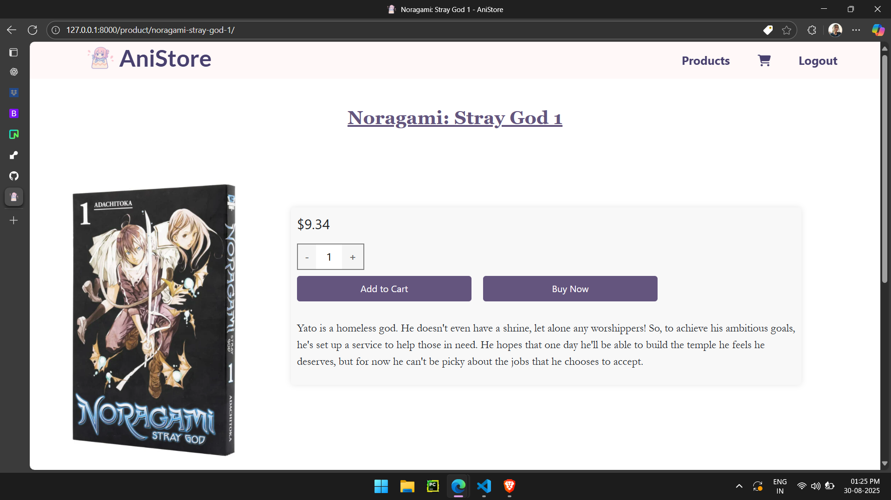
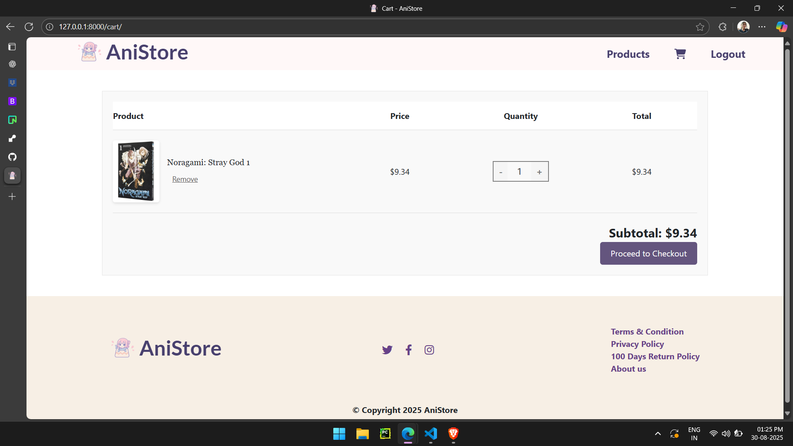

# 🛍️ AniStore - Anime-Themed E-commerce Website

Welcome to **AniStore**, a full-featured e-commerce web application built with Django. This project enables users to browse anime-themed products, manage a shopping cart, and securely check out using Stripe integration.

---

## 📸 Live Preview

Explore the live version of AniStore:

🔗 **Live Demo:** [Visit AniStore on Render](https://your-anistore-url.onrender.com)

---

### Screenshots

---

## 💡 Features You’ll Love

### 🛒 Shopping Experience
- 🧾 **Dynamic product listings** by category
- 🔍 Product **detail pages** with images, prices, descriptions, and care instructions
- 🛍️ **Add to Cart** and **Buy Now** options with quantity control
- 📦 Real-time cart update and removal
- ✅ Stripe-powered **checkout** with secure form validation
- 📬 **Success and failure pages** after payment

### 👥 User Management
- 🔐 **User authentication** (Sign up, Log in, Log out)
- 🎟️ Authenticated users can **manage carts**, checkout, and complete orders

### 📱 Frontend
- 🎨 **Responsive design** built with Bootstrap 5
- 🖼️ Mobile-friendly **carousel for featured products**
- 📂 Organized categories, clean typography, and image-first layout
- 🐍 Powered by Python and Django templating for dynamic rendering

### ⚙️ Backend (Django)
- 🗂️ Reusable base template with block structure
- 🧠 Context-aware views with pagination and filtering
- 🔒 CSRF-protected forms for secure user actions
- 🛠️ Reusable static and media file configuration

---

## 🛠️ Built With

| Tech Stack       | Description                             |
|------------------|-----------------------------------------|
| 🐍 **Python**     | Core language powering the backend       |
| 🌐 **Django**     | Web framework for backend logic          |
| 🧠 **SQLite**     | Lightweight DB for development/testing   |
| 🎨 **Bootstrap 5**| Styling & responsive frontend layout     |
| 💳 **Stripe API** | Secure payment processing                |
| 🧾 **HTML/CSS**   | Frontend templates & styling             |
| 🔐 **Django Auth**| Built-in user authentication system      |

---

## 🤝 Contributing

Contributions are welcome! Please open an issue or submit a pull request with your improvements or bug fixes.

